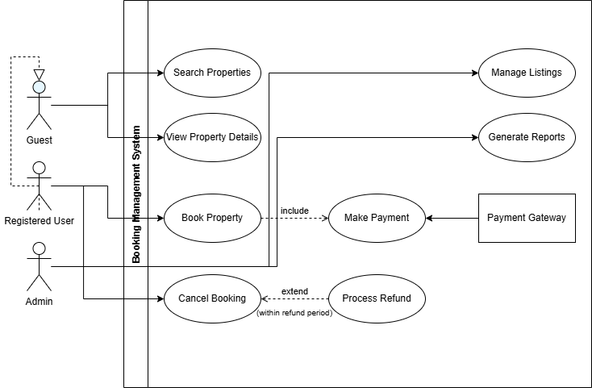

# Requirement Analysis in Software Development

This repository documents the process and best practices of Requirement Analysis in software development.
It focuses on a booking management system to simulate real-world software requirement gathering, analysis, and documentation.

---

## What is Requirement Analysis?

Requirement Analysis is the process of understanding, documenting, and managing the needs and conditions for a software system. It is a critical phase in the Software Development Life Cycle (SDLC) that ensures developers and stakeholders share a clear and common understanding of what the software must achieve.

This phase involves gathering requirements from users, analyzing these requirements for feasibility and clarity, and documenting them in a structured form that guides design and development. Effective Requirement Analysis helps minimize project risks, reduces rework, and ensures the final product meets user expectations.

---

## Why is Requirement Analysis Important?

- **Clarity and Understanding:** It provides a clear understanding of user needs and business goals, aligning all stakeholders.
- **Prevents Scope Creep:** Helps define boundaries and prevents unplanned features or changes.
- **Reduces Risks and Costs:** Identifies potential issues early, avoiding costly mistakes during development.

---

## Key Activities in Requirement Analysis

- **Requirement Gathering:** Collecting raw data and user needs from stakeholders.
- **Requirement Elicitation:** Engaging stakeholders through interviews, surveys, and workshops to clarify and expand requirements.
- **Requirement Documentation:** Writing clear, unambiguous, and structured requirement specifications.
- **Requirement Analysis and Modeling:** Organizing and prioritizing requirements; creating models like use case diagrams.
- **Requirement Validation:** Ensuring requirements are feasible, consistent, and meet stakeholder approval.

---

## Types of Requirements

### Functional Requirements

Functional requirements specify what the system should do.

**Examples for Booking Management System:**

- Users can search for available booking slots.
- Users can create, modify, and cancel bookings.
- The system sends email notifications after booking confirmation.

### Non-functional Requirements

Non-functional requirements specify how the system performs its functions.

**Examples:**

- The system should respond to search queries within 2 seconds.
- The application must support at least 1000 concurrent users.
- User data must be encrypted both in transit and at rest.

---

## Use Case Diagrams

Use Case Diagrams visually represent the interactions between users (actors) and the system's functionalities (use cases). They help in understanding the system scope and user interactions clearly.

**Actors:**

- User
- Administrator

**Use Cases:**

- Search Booking Slots
- Create Booking
- Modify Booking
- Cancel Booking
- Manage Users (Admin only)

---

## Acceptance Criteria

Acceptance Criteria define the conditions that must be met for a feature to be considered complete and acceptable by the stakeholders. They provide measurable and testable statements to validate functionality.

**Example: Checkout Feature**

- The user must be able to review booking details before checkout.
- Payment methods should include credit card and PayPal.
- The system must display a confirmation message and send a confirmation email upon successful payment.
- Transactions should be processed within 5 seconds.
